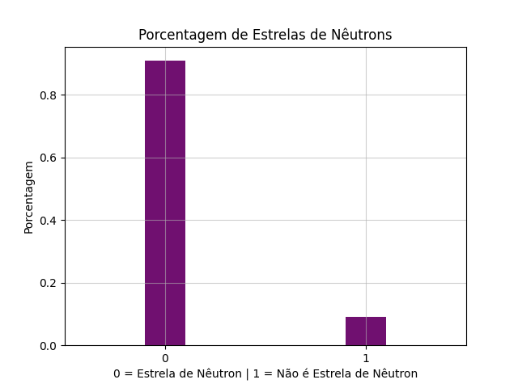
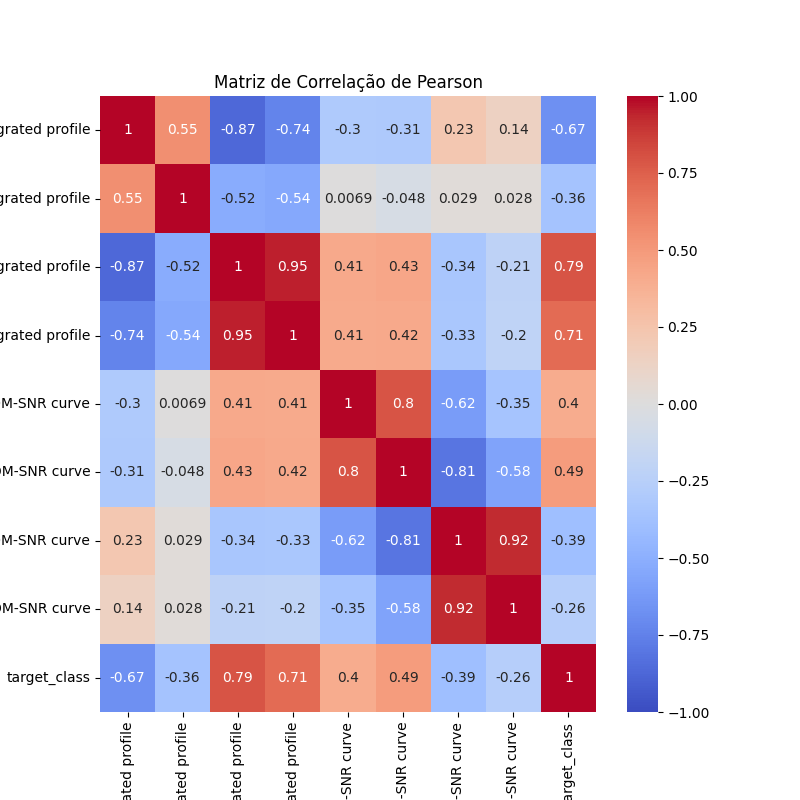
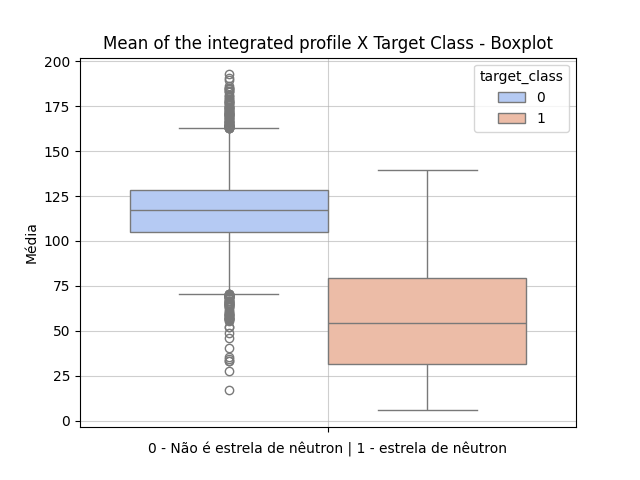
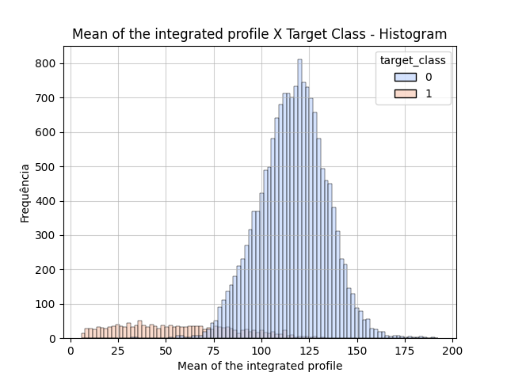
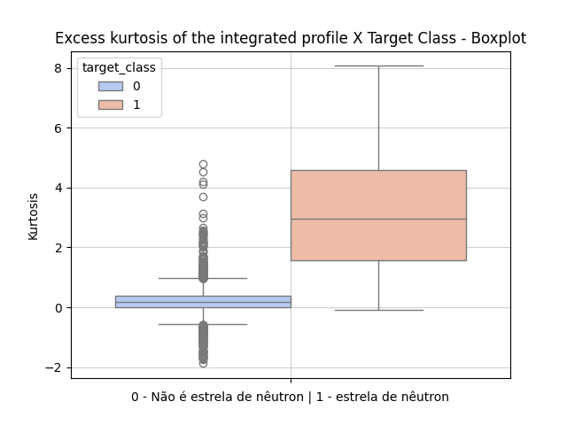
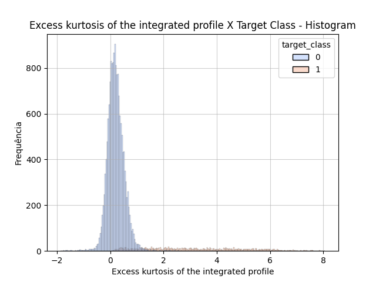
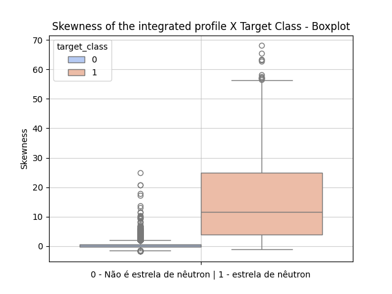
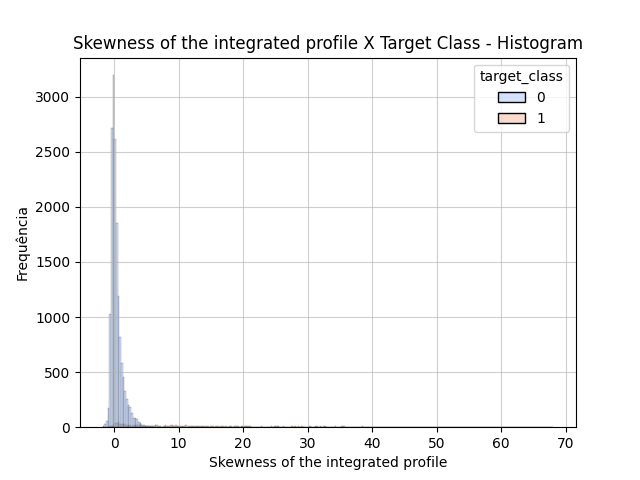
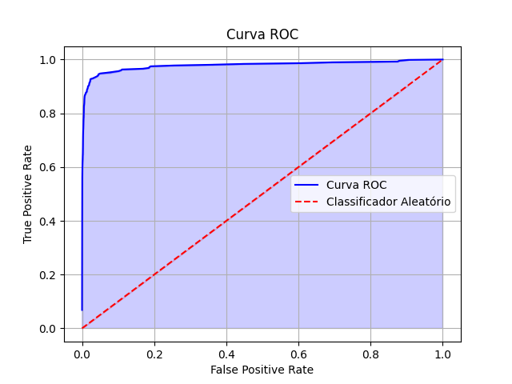
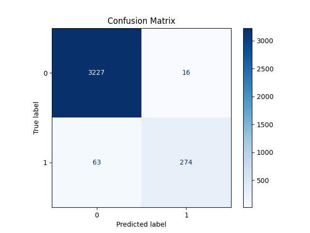

# Regressão Logística - Classificador para Estrelas de Nêutrons Pulsares


## Resumo
Um classificador binário de estrelas de nêutrons pulsares reais a partir de observações astronômicas captadas por radiotelescópios. O contexto envolve a aplicação de técnicas de classificação para diferenciar pulsares de outras fontes astrofísicas ou ruído, utilizando dados estatísticos extraídos de sinais de rádio.

## Descrição do Dataset
O dataset é composto por 17.898 observações, cada uma representando medições estatísticas de sinais obtidos por radiotelescópios. Abaixo estão os oito atributos disponíveis:

1. Mean of the integrated profile: Média do perfil integrado do sinal, que representa a média da intensidade do sinal ao longo do tempo.
2. Standard deviation of the integrated profile: Desvio padrão do perfil integrado, indicando a variação da intensidade em torno da média.
3. Excess kurtosis of the integrated profile: Curtose excessiva do perfil integrado, que mede a "cauda" da distribuição do sinal em relação a uma distribuição normal.
4. Skewness of the integrated profile: Assimetria do perfil integrado, representando o grau de distorção da distribuição do sinal em torno da média.
5. Mean of the DM-SNR curve: Média da curva DM-SNR (medida da razão sinal-ruído em função da dispersão), que quantifica a intensidade média do sinal ajustado por diferentes dispersões.
6. Standard deviation of the DM-SNR curve: Desvio padrão da curva DM-SNR, indicando a variabilidade da razão sinal-ruído em diferentes dispersões.
7. Excess kurtosis of the DM-SNR curve: Curtose excessiva da curva DM-SNR, avaliando a presença de picos extremos na distribuição da razão sinal-ruído.
8. Skewness of the DM-SNR curve: Assimetria da curva DM-SNR, que mostra a inclinação da distribuição da razão sinal-ruído em relação à média.
9. target_class: Classe alvo binária que indica o tipo de objeto:
   + 1: Pulsares reais (estrelas de nêutrons altamente magnetizadas)
   + 0: Não-pulsares (ruído ou outras fontes astrofísicas)

## Bibliotecas utilizadas
1. Python
2. FastAPI
3. Uvicorn
4. Pydantic
5. TVM
6. NumPy
7. Pandas
8. Matplotlib
9. Seaborn
10. Scikit-learn
11. Optuna
12. Joblib
13. Pingouin

## Como rodar
### Construção do modelo
```bash
pipenv sync
pipenv shell
python modelo.py
```
### API
Testar na porta 8080 do postman na rota /classify
```bash
pipenv sync
pipenv shell
uvicorn api:app --host 0.0.0.0 --port 8080
```
### API com Docker
Testar na porta 3333 do postman na rota /classify
```bash
docker build -t modelpulsar .
docker run -d --name mymodelapp -p 3333:8080 modelpulsar
```
### Exemplo de body para a requisição
```bash
{
  "mean_integrated_profile": 140.5625,
  "std_integrated_profile": 55.68378214,
  "kurtosis_integrated_profile": -0.234571412,
  "skewness_integrated_profile": -0.699648398,
  "mean_dmsnr_curve": 3.199832776,
  "std_dmsnr_curve": 19.11042633,
  "kurtosis_dmsnr_curve": 7.975531794,
  "skewness_dmsnr_curve": 74.24222492
}
```

## Análise Exploratória dos Dados (EDA)
### Observações iniciais
1. Não há dados nulos
2. Dados contínuos não vêm na mesma medida, logo há necessidade de usar um Transformer de Standard Scaler.

### Variável Target


A distribuição da variável target é desbalanceada. Sabendo disso, classificar ambos valores binários é importante, logo a métrica escolhida será a ***'F1-Score'*** com average *'macro'*. Ou seja, ele calcula o f1-score para 0 e o f1-score para 1 e faz a média de ambos.

### Análises Bivariadas


A matriz de correlação de Pearson já revela que a curva DM-SNR tem os valores que menos impactam linearmente falando como um todo, pois das 8 variáveis independentes, as 3 mais correlacionadas não estão nesta curva. Isto já sugere que talvez não seja preciso usar todas as variáveis para o modelo de classificação.

Por conta disso, é mostrado nesta documentação somente essas 3 variáveis, já que são mais correlacinadas com a target linearmente.

### Nova métrica estudada de análise da variável para ser usada: T-Student Test
A métrica **T-Student** está sendo usada para dizer se uma variável tem uma diferença de média significativa entre sua classificação binária para alguma variável.
Assume a seguinte Hipótese nula(H0):
+ H0: Os 2 grupos não apresentam uma diferença média significativa.
+ H1: Os 2 grupos apresentam uma diferença média significativa.
> A hipótese nula não é rejeitada caso o p-value do teste assuma um valor maior que *0.05*
> p-value >= 0.05 -> Não rejeita H0

Ex: divide os dados de peso da fruta a partir da classificação de qualidade. Se a amostra *'good'* e a mostra *'bad'* tiverem uma diferença média não significativa, há uma evidência(não é uma prova) para não usar essa variável como uma variável significativa da amostra.

As três variáveis abaixo obtiveram p-valor próximo de 0, logo rejeitam a hipótese nula e indicam evidência muito forte de apresentarem uma diferença média significativa.

### Variável Perfil Médio




O perfil médio visivelmente é uma variável muito boa para descrever o modelo, o que já era esperado pelo correlação de Pearson. Como se pode ver os valores cobertos para 0 e 1 são diferentes, o que permite classificar praticamente com certeza muitos membros se é uma estrela de nêutron ou nãosomente a partir dessa variável.

### Quão extremo é o sinal (Curtose)




A curtose do perfil é também uma variável muito boa para descrever o modelo, o que já era esperado pelo correlação de Pearson, no caso até a melhor variável. Como se pode ver os valores cobertos para 0 e 1 são diferentes, o que permite classificar praticamente com certeza muitos membros se é uma estrela de nêutron ou não somente a partir dessa variável. Funciona quase que de forma inversa à variável anterior. O histgrama em caso de Estrela de Nêutron sofre um grande shift à direita e uma distribuição praticamente uniforme.

### Assimetria do sinal (Skewness)




A assimetria do perfil(sinal) é também uma variável muito boa para descrever o modelo, o que já era esperado pelo correlação de Pearson. Como se pode ver os valores cobertos para 0 e 1 são diferentes, o que permite classificar praticamente com certeza muitos membros se é uma estrela de nêutron ou não somente a partir dessa variável. Mostra que estrelas tem uma assimetria positiva grande(cauda longa à direita) em geral, enquanto não-estrelas de nêutron não tendem a não ter uma assimetria(assimetria = 0).

## Treinamento do modelo

O modelo uso o algoritmo de Regressão Logística clássico usando todas as variáveis. O modelo de separação de teste foi a separação aleatória dos dados em conjunto de treino(70% da amostra) e de teste(30% da amostra). Em seguida, tentou-se fazer tuning de hiperparâmetros com ***Optuna***, que foram:

1. C-value
2. penalty

Esses parâmetros buscaram nessa ordem:

1. Maximizar a **área sob a curva ROC**
2. Maximizar o **F1-Score**
3. Minimizar o **Log Loss**

O modelo com tuning de hiperparâmetros não resultou em uma melhora do modelo significativa, logo o modelo que permaneceu foi o caso base.

Em seguida, também com ***Optuna***, buscou-se otimizar o modelo com menos variáveis. Com o uso de somente as 5 melhores variáveis(Uso de SelectKBest com f_classifier) ao invés de 8, o modelo conseguiu gerar classes mais fortes e piorar muito pouco o f1-score. Isso foi interessante, já que um modelo mais leve foi capaz de explicar tão bem quanto o modelo que usa todas as variáveis. Com isso, o caso base foi mantido

## Métricas do Modelo
### Modelo Baseline


|Área sob curva ROC|F1-Score macro avg|Recall macro avg|Precision macro avg|Accuracy|Log Loss|
|:-:|:-:|:-:|:-:|:-:|:-:|
|≃ 0.9786|≃ 0.9310|≃ 0.9|≃ 0.96|≃ 0.98|≃ 0.795377|

A área sob a curva foi de ≃ 0.8415 unidades de área(u.a). Um classificador aleatório que chuta aleatoriamente a classificação tem 50% de acerto, ou seja, tem uma área de 0.5, cuja curva representa a reta vermelha no gráfico. **Por ter uma curva acima dessa linha/ter uma área maior que essa linha, o modelo é melhor que um classificador aletório.**



A matriz de confusão elucida os resultados. No caso, é possível ver o grande desbalanceio de estrelas no teste. É possível ver que o modelo dificilmente classifica uma não-estrela como estrela. Contudo, deixa passar significativamente(cerca de 1/6) algumas estrelas de nêutrons. O *'recall'* do modelo para o caso 1 é 0.81, o que elucida esse erro.

### Modelo com hiperparâmetros otimizados
> Métricas obtidas:

|Área sob curva ROC|F1-Score|Log-Loss|
|:-:|:-:|:-:|
|≃ 0.9781|≃ 0.9348|≃ 0.7551|

> Dados obtidos dos melhores hiperparâmetros:
1. O F1-Score é melhorado ligeiramente.
2. O Log Loss é melhorado ligeiramente.
3. A área sob a curva ROC diminui.

> Hiperparâmetros selecionados:

|Penalty|C-valor|
|:-:|:-:|
|l2|10|

### Modelo com KBest variáveis

Usou-se o f-classif para selecionar as k melhores variáveis, visto que elas apresentavam valores contínuos e negativos, o que não é bom para o teste Qui-Quadrado.

> Dados obtidos do melhor k:

|número de variáveis (k)|Área sob curva ROC|F1-Score|Log-Loss|
|:-:|:-:|:-:|:-:|
|5|≃ 0.9827|≃ 0.92998|≃ 0.8054|

Com somente as 5 melhores variáveis, obteve-se:
1. Uma área sob a curva ROC maior que o modelo baseline.
2. Um F1-Score ligeiramente menor que o modelo baseline.
3. Um log-loss ligeiramente maior que o modelo baseline.

Apesar de acertar ligeiramente menos e ter um pouco mais de perda, o modelo mais simples é praticamente capaz de explicar da mesma forma que o modelo baseline.

## Melhorias para o modelo
1. Certamente seriam necessários mais registros.
2. Certamente é possível encontrar mais variáveis para essas estrelas.
3. Escolha de divisão dos testes por Stratified K-Folds já que a classe target é desbalanceada.
4. O logloss é de 0.8, o que é considerado razoável. Logo o modelo, embora acerte muito, não está acertando de forma muito confiante. O ideal seria ter um log loss de pelo menos 0.2 para ser ideal.

## Considerações
Usou-se stratify para separar dados de treino e teste com o objetivo de manter a mesma proporção de dados devido ao desbalanceio da classe target. Contudo, por azar, a estratificação piorou o modelo, logo isso justifica a ausência desse parâmetro, que idealmente deveria ajudar o modelo.

## Créditos
Pedro Sodré, 9 de Junho de 2026